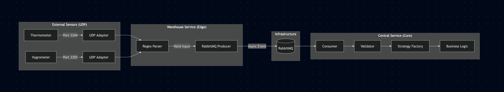

# Sensor Monitoring System Demo

## Project Summary

A robust, event-driven microservices architecture designed to collect, process, and analyze real-time sensor data. This
project demonstrates best practices in **Spring Boot 3**, **Spring Cloud Stream**, **Hexagonal Architecture**, and
**Resiliency Patterns**.

This module is a Message-Driven Microservice designed for high-performance network integration. Its primary role is
likely acting as an Edge/Adapter Service that listens for raw network traffic (UDP/TCP) using Spring Integration,
processes it, and then publishes it as events to a RabbitMQ message broker using Spring Cloud Stream. It includes
production-ready features like validation, health monitoring (Actuator), and structured logging for observability.

---

## Architecture Overview

The system consists of two decoupled services communicating via an Event Broker (RabbitMQ).

---

## Modules

### UDP Listener: `Warehouse Service (Edge Collector)`

    - Listens on UDP ports (3344(Temp), 3355(Hum), 3366(Debug))
    - Parses raw strings (Regex)
    - Publishes normalized events to RabbitMQ

### Alert Monitoring: `Central Service (Core Processor)`

    - Consumes events from RabbitMQ
    - Routes logic via Factory + Strategy Pattern
    - Handles Retries & Dead Letter Queue (DLQ)

---

## Technology Stack

    - Language: Java 21
    - Framework: Spring Boot 3.4.1
    - Build Tool: Gradle 8.x
    - Containerization: Docker & Docker Compose
    - Testing: JUnit 5 (Parallel Execution), Mockito, AssertJ, Testcontainers

    Core Framework:
        - Spring Boot 3: The foundational framework (inferred from spring-boot-starter-*).
        - Spring Integration: Used for low-level network communication (UDP/TCP handling via spring-integration-ip).
        - Spring Cloud Stream: Used for abstracting the messaging layer (binding to RabbitMQ).
    
    Messaging & Integration:
        - RabbitMQ: The message broker used for asynchronous communication.
        - UDP/IP Support: The application is capable of receiving or sending data over raw IP sockets (likely UDP based on previous context).
    
    Observability & Logging:
        - Spring Boot Actuator: Provides health checks, metrics, and monitoring endpoints.
        - Logstash Logback Encoder: Formats logs into JSON for easy ingestion into the ELK Stack (Elasticsearch, Logstash, Kibana).
    
    Utility:
        - Lombok: Reduces boilerplate code (Getters, Setters, Builders).
        - Jackson: Handles JSON serialization/deserialization.
        - Jakarta Validation: Enforces data integrity rules on incoming payloads.
    
    Testing:
        - JUnit 5: The test runner.
        - Spring Boot Test: Integration testing context.
        - Spring Rabbit Test: Specialized utilities for testing AMQP interactions.

## Getting Started ##

### Prerequisites

    - Java 21 SDK installed
    - Docker & Docker Compose running

### One-Click Deployment

Use the included script to clean, build, test, and deploy everything: This script will:

    1. Kill old containers.
    2. Run Unit Tests (Parallel Mode).
    3. Generate JaCoCo Coverage Reports.
    4. Build Docker images.
    5. Start the infrastructure.

Open terminal and:

- `git clone https://github.com/elvintaghizade14/sensor-monitoring-demo.git` - clone the project
- `cd ./banking` - change directory into the project
- `chmod +x ./start.sh` - add permission to `start.sh` file to be able to run command inside it
- `chmod +x ./gradlew`  - add permission to `gradlew` file to be able to clean and build
- `./start.sh` - start app
- `./stop.sh`  - stop app

---

## Testing the System

You can simulate sensors using netcat (nc). Open a terminal and run:

### Send Temperature Data (Port 3344)

    1. Normal:    echo -n "sensor_id=t1;value=25.5" | nc -u -w1 localhost 3344

    2. High:      echo -n "sensor_id=t1;value=50.3" | nc -u -w1 localhost 3344

### Send Humidity Data (Port 3355)

    1. Normal:    echo -n "sensor_id=h1;value=38.0" | nc -u -w1 localhost 3355

    2. High:      echo -n "sensor_id=h1;value=80.0" | nc -u -w1 localhost 3355

### Testing Resiliency (DLQ & Retries)

The system includes a "Poison Pill" strategy to test fault tolerance. Sending a sensor ID of `"die"` triggers a runtime
exception in the `central-service`.

    # This will cause the consumer to crash, retry 3 times, and move to DLQ:
    echo -n "sensor_id=die;value=0" | nc -u -w1 localhost 3366

    # Expected Log Output:
    WARN ... FAILURE TRIGGERED: Simulating runtime crash for [ID: die]. RabbitMQ should catch this and RETRY.

---
